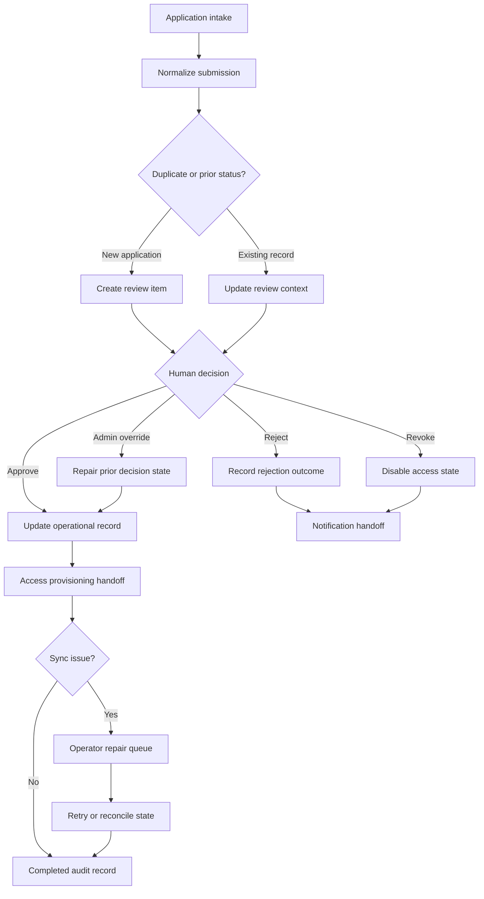

# Member Onboarding Automation

Sanitized case study based on onboarding and registration workflows with review decisions, access provisioning, admin override, and repair paths.

## What This Is Based On

- Form-based application intake
- Workflow-orchestrated review processing
- Approve, reject, revoke, and admin override paths
- Access sync and notification steps
- Repair scripts for stuck or inconsistent review states

## What It Demonstrates

- Member/application intake
- Duplicate and prior-status checks
- Human review queue
- Approve/reject/revoke decisions
- Access provisioning and notification handoff
- Admin override for reversible decisions
- Sync repair and audit records

## Operational Complexity

- Branching review states for approve, reject, revoke, and admin override
- Duplicate/prior-state handling before downstream access changes
- Provisioning and notification handoffs separated from the review decision
- Repair queue when sync or access state needs operator attention
- Completed audit record for final state and replay context

## How It Works

1. A synthetic application enters through form intake.
2. The workflow normalizes identity and application fields.
3. Prior records are checked before creating or updating the review item.
4. A reviewer approves, rejects, revokes, or uses an admin override.
5. The decision updates the operational record and downstream access state.
6. Sync issues are routed to operator repair instead of being hidden.
7. The final state is written as a completed audit record.

## Architecture



## Example Input

```json
{
  "event_id": "evt_member_onboarding_001",
  "application": {
    "application_id": "app_demo_1042",
    "member_ref": "member_demo_1042",
    "requested_access": ["workspace", "resource_library"]
  },
  "review_context": {
    "source": "form_intake",
    "prior_status": null,
    "duplicate_key": "member_demo_1042|access_program_demo"
  }
}
```

## Example Output

```json
{
  "workflow_status": "completed",
  "application_id": "app_demo_1042",
  "decision": {
    "status": "approved",
    "admin_override_used": false
  },
  "handoff": {
    "operational_record": "updated",
    "access_state": "provisioned",
    "notification": "queued"
  },
  "repair": {
    "required": false
  }
}
```

## What Was Sanitized

This example removes vertical-specific labels, real applicants, private access rules, exact sheet/database schemas, workspace names, provider names, and production endpoints.

## What To Notice

The important pattern is not just intake automation. It is controlled state management: review decisions, reversible overrides, access sync, and repair paths when the automation and operational record drift.

## Synthetic n8n Demo

- [n8n-demo/workflow.json](./n8n-demo/workflow.json): importable synthetic workflow
- [n8n-demo/sample-input.json](./n8n-demo/sample-input.json): mock application payload
- [n8n-demo/sample-output.json](./n8n-demo/sample-output.json): mock audit/provisioning result
- Future screenshot path: `assets/n8n-workflow-snapshot.png`
