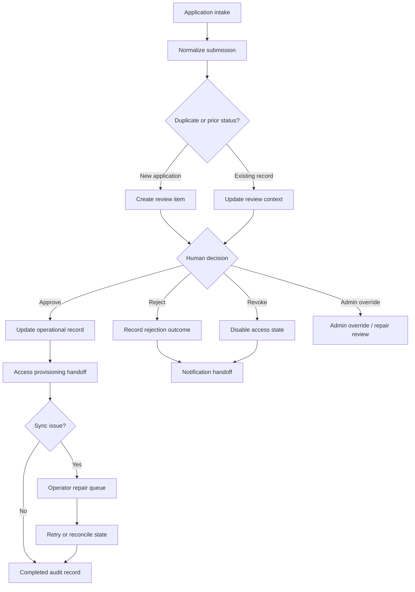

# Member Onboarding Automation

A workflow for turning member applications into reviewed access decisions, with override and repair paths.

## Context

- Based on form-based application intake and review processing
- Covers approve, reject, revoke, and admin override states
- Connects review decisions to access provisioning, notification, and audit records

## Outcome
- Handled 6,800+ records in live production
- Saved approximately three minutes of manual processing per record
- Eliminated an estimated 340+ hours of repetitive operational work—equivalent to more than 42 eight-hour workdays

## Architecture



## Example Input

IDs are public example keys. They represent stable workflow references such as contact refs, form submissions, review records, or handoff keys.

```json
{
  "event_id": "member_onboarding_event_001",
  "application": {
    "application_id": "application_001",
    "member_ref": "member_001",
    "requested_access": ["workspace", "resource_library"]
  },
  "review_context": {
    "source": "form_intake",
    "prior_status": null,
    "duplicate_key": "member_001|access_program"
  }
}
```

## Example Output

```json
{
  "workflow_status": "completed",
  "application_id": "application_001",
  "decision": {
    "status": "approved",
    "admin_override_used": false
  },
  "handoff": {
    "operational_record": "updated",
    "access_state": "provisioned",
    "notification": "queued"
  },
  "repair": {
    "required": false
  }
}
```

## What To Notice

- Review state is controlled before access state changes.
- Admin override is separated as an operator review path before any automatic access change.
- Retry/reconcile is reserved for sync or provisioning repair, not every override case.
- The workflow creates a final audit record for replay and reconciliation.

## Synthetic n8n Demo

- [n8n-demo/workflow.json](./n8n-demo/workflow.json): importable workflow
- [n8n-demo/sample-input.json](./n8n-demo/sample-input.json): mock application payload
- [n8n-demo/sample-output.json](./n8n-demo/sample-output.json): mock audit/provisioning result
