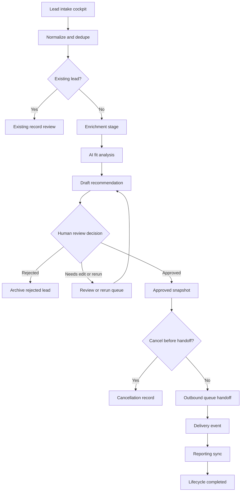

# Lead Enrichment & Outreach System

A workflow for turning rough lead inputs into enriched, reviewed, handoff-ready records.

## Context

- Based on lead intake, enrichment, and review queue workflows
- Separates enrichment/review from outbound execution
- Covers approval snapshots, queue handoff, events, replies, cancellation, and reruns

## Outcome
- Processed and supported outreach to 1,500+ leads per week
- Reduced manual processing time by approximately three minutes per lead
- Saved an estimated 75+ hours of operational work per week at a volume of 1,500 leads
- Maintained enrichment costs between USD 0.03 and USD 0.05 per lead, or up to approximately USD 75 per 1,500-lead batch
- Generated a 3–5% reply rate, equivalent to approximately 45–75 replies per 1,500 leads contacted
- Achieved a 1.4% visit rate, equivalent to approximately 21 visits per 1,500 leads

## Architecture



## Example Input

IDs are public example keys. They represent stable workflow references such as contact refs, form submissions, review records, or handoff keys.

```csv
lead_id,source_type,profile_ref,category_hint,contact_ref,notes
lead_001,public_directory,profile_alpha,automation_operator,contact_ref_001,Strong workflow systems signal
lead_002,event_list,profile_beta,growth_ops,contact_ref_002,Needs category confirmation
```

## Example Output

```json
{
  "batch_id": "lead_batch_001",
  "dedupe": {
    "status": "new"
  },
  "enrichment": {
    "status": "complete",
    "source_count": 3
  },
  "approved_snapshot": {
    "lead_id": "lead_001",
    "ai_analysis": {
      "fit_tier": "high",
      "confidence": 0.86
    },
    "human_review": {
      "status": "approved",
      "accepted_values": ["approved", "needs_edit", "rejected"]
    },
    "review_loop": {
      "status": "not_required",
      "rerun_allowed": true
    },
    "outbound_handoff": {
      "queued": true,
      "sender_mode": "manual_or_controlled",
      "cancel_before_handoff": false,
      "events_tracked": ["delivery", "reporting_sync"]
    }
  }
}
```

## What To Notice

- Approval creates a stable snapshot before outbound action.
- AI analysis supports human review instead of replacing it.
- Cancellation is modeled at handoff time, after review but before outbound action.
- Rerun and reporting paths are modeled separately from enrichment.

## Synthetic n8n Demo

- [n8n-demo/workflow.json](./n8n-demo/workflow.json): importable workflow
- [n8n-demo/sample-input.json](./n8n-demo/sample-input.json): mock lead intake payload
- [n8n-demo/sample-output.json](./n8n-demo/sample-output.json): mock approved handoff result
