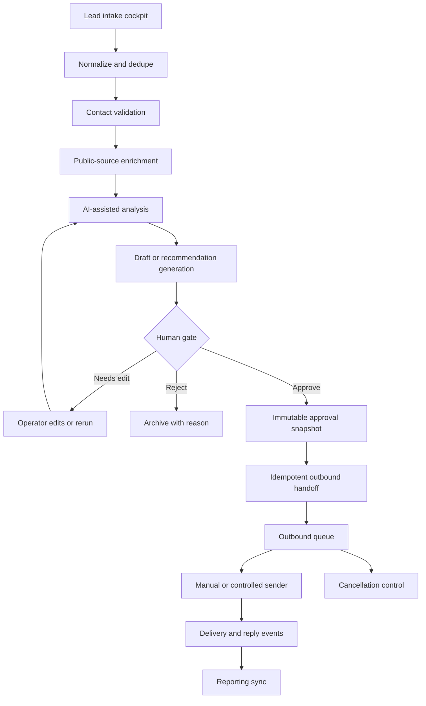

# Lead Enrichment & Outreach System

Sanitized case study based on a two-part lead operations system: enrichment and review first, outbound handoff second.

## What This Is Based On

- Lead intake and enrichment workflows
- Operational spreadsheet/database review cockpit
- AI-assisted extraction, analysis, drafting, and optimization stages
- Human gate before outbound action
- Approval handoff into a separate queue-based outreach engine
- Event/reply/reconciliation and cancellation/rerun controls

## What It Demonstrates

- Lead intake from rough public-source records
- Enrichment and platform/source extraction
- Email/contact validation as a workflow stage
- AI-assisted analysis and draft generation
- Human review before approval
- Idempotent approval handoff
- Outbound queue, event tracking, reply capture, reporting sync
- Cancellation and rerun control when a record should not continue

## Operational Complexity

- Enrichment/review system separated from outbound execution
- Deduplication before enrichment and before handoff
- AI-assisted analysis treated as a review input, not an automatic decision
- Approved snapshot creates a stable handoff contract
- Cancellation, rerun, event tracking, reply capture, and reconciliation paths

## How It Works

1. New leads enter an intake cockpit.
2. The workflow normalizes fields, validates contact data, and deduplicates records.
3. Enrichment and extraction stages add public context.
4. AI-assisted stages classify, summarize, or draft next-step content.
5. Human review decides whether the record is approved, edited, rejected, or rerun.
6. Approved records are snapshotted and handed off idempotently to an outbound queue.
7. Delivery events, replies, reporting, and cancellations are handled in a separate lifecycle layer.

## Architecture



## Example Input

IDs are synthetic public examples. They represent stable workflow keys such as contact references, row IDs, form submissions, review records, or handoff keys.

```csv
lead_id,source_type,profile_ref,category_hint,contact_ref,notes
lead_001,public_directory,profile_alpha,automation_operator,contact_ref_001,Strong workflow systems signal
lead_002,event_list,profile_beta,growth_ops,contact_ref_002,Needs category confirmation
```

## Example Output

```json
{
  "batch_id": "lead_batch_001",
  "approved_snapshot": {
    "lead_id": "lead_001",
    "dedupe_status": "new",
    "enrichment_status": "complete",
    "ai_analysis": {
      "fit_tier": "high",
      "confidence": 0.86
    },
    "human_gate": {
      "status": "approved"
    },
    "outbound_handoff": {
      "queued": true,
      "sender_mode": "manual_or_controlled"
    }
  }
}
```

## What Was Sanitized

This example removes vertical-specific labels, real leads, real sources, exact provider names, campaign copy, mailbox/provider details, private schemas, workflow IDs, and production endpoints.

## What To Notice

The strongest part of this system is the boundary between enrichment/review and outbound execution. Approval creates a stable snapshot, and the outbound side is separated so sending, events, replies, and reporting can be controlled independently.

## Synthetic n8n Demo

- [n8n-demo/workflow.json](./n8n-demo/workflow.json): importable synthetic workflow
- [n8n-demo/sample-input.json](./n8n-demo/sample-input.json): mock lead intake payload
- [n8n-demo/sample-output.json](./n8n-demo/sample-output.json): mock approved handoff result
- Future screenshot path: `assets/n8n-workflow-snapshot.png`
