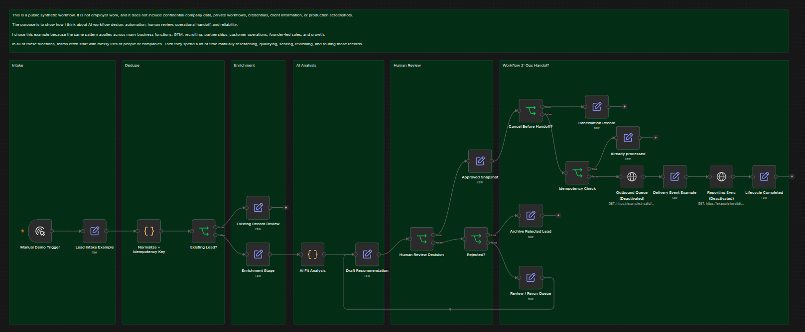

# n8n Demo

Importable n8n workflow for the lead enrichment and outreach case study.

## Preview

Current canvas snapshot of the importable workflow.

## Files

- `workflow.json`: workflow canvas
- `sample-input.json`: reference input
- `sample-output.json`: expected output shape

## Idempotency Gate

This demo includes an idempotency gate before the outbound queue handoff.

After a lead is approved, the workflow carries a stable idempotency key for the approved outbound handoff. Before the outbound handoff runs, the `Idempotency Check` node models a lookup for whether that exact handoff has already been processed.

If the key has already been processed, the workflow routes to `Already processed` and skips the outbound queue call. This prevents duplicated outreach caused by retries, duplicated events, manual replay, or timeout recovery.

If the key has not been processed, the workflow continues to the outbound queue handoff path. After the successful handoff, `Delivery Event Example` and `Lifecycle Completed` carry receipt fields showing that the outbound handoff idempotency key has been recorded.

In this demo:

- `Idempotency Check` = checks whether the protected outbound handoff was already processed
- `Already processed` = safe no-op branch that prevents the outbound queue from being called again
- `lead_001:approved` = stable key protecting the approved outbound handoff action
- The idempotency key protects the action, not the entire lead record
- The lead stage/status still tracks the lead lifecycle
- The idempotency receipt tracks whether this specific outbound handoff action happened

Main path:

`Human Review Approved -> Approved Snapshot -> Idempotency Check -> Outbound Queue`

Duplicate/replay path:

`Idempotency Check -> Already processed -> Skip outbound handoff`

This is a demo-level model. In production, the check and receipt update would usually use durable storage.

## Use

1. Import `workflow.json` into a clean n8n workspace.
2. Run from the manual trigger.
3. Use `sample-input.json` as the reference input.
4. Use the canvas snapshot as the public visual reference.
