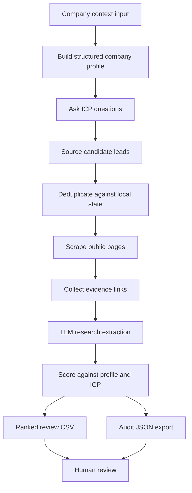

# Investor Lead Gen Agent

A Python-style research agent for sourcing, enriching, scoring, and exporting investor leads for review.

## Context

- Based on a local CLI agent workflow with saved state
- Uses company context, ICP criteria, public sourcing, enrichment, and scoring
- Produces ranked review exports instead of direct outreach automation

## Architecture



## Example Input

IDs are public example keys. They represent stable workflow references such as contact refs, form submissions, review records, or handoff keys.

```json
{
  "run_id": "investor_agent_run_001",
  "company_context": {
    "stage": "example_stage",
    "market": "example_market"
  },
  "source_inputs": {
    "input_list_count": 12,
    "source_page_count": 3,
    "search_enabled": false
  },
  "review_settings": {
    "min_score": 60,
    "human_review_required": true
  }
}
```

## Example Output

```json
{
  "status": "review_export_ready",
  "summary": {
    "candidates_sourced": 24,
    "deduped_candidates": 17,
    "ranked_for_review": 6
  },
  "top_review_record": {
    "lead_ref": "investor_lead_001",
    "score": 84,
    "fit_tier": "high",
    "human_review_status": "pending"
  }
}
```

## What To Notice

- The agent keeps state across sourcing, enrichment, scoring, and export.
- Evidence collection and LLM extraction feed a ranked human review output.
- The workflow is agentic, but the final decision remains review-based.
