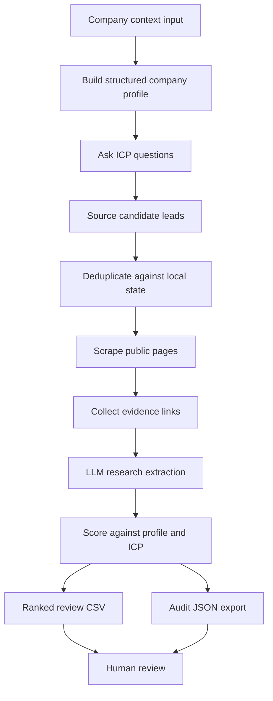

# Investor Lead Gen Agent

Sanitized case study based on a local Python CLI agent for sourcing, enriching, scoring, and exporting investor leads for human review.

## What This Is Based On

- Local Python CLI workflow
- Company profile builder from private input documents
- Dynamic ICP question flow
- Investor candidate sourcing from input lists and public pages
- Deduplication against local JSON state
- Public page scraping and evidence collection
- LLM extraction and scoring
- Ranked review CSV/JSON export

## What It Demonstrates

- Agentic workflow design beyond visual automation tools
- Structured state management across sourcing, enrichment, scoring, and export
- LLM-assisted research extraction with evidence links
- Deduplication and freshness checks
- Human-review outputs instead of direct outreach automation

## How It Works

1. The operator provides company context and source inputs.
2. The agent builds a structured company profile.
3. The agent asks ICP questions and saves normalized criteria.
4. Candidate leads are sourced from input lists, source pages, or optional search routes.
5. Candidates are deduped before enrichment.
6. Public pages are scraped and evidence is collected.
7. LLM extraction creates structured research records.
8. Scoring ranks candidates against the company profile and ICP.
9. The agent exports a review CSV and audit JSON for human review.

## Architecture



## Example Input

```json
{
  "run_id": "investor_agent_demo_001",
  "company_context": {
    "stage": "example_stage",
    "market": "example_market"
  },
  "source_inputs": {
    "input_list_count": 12,
    "source_page_count": 3,
    "search_enabled": false
  },
  "review_settings": {
    "min_score": 60,
    "human_review_required": true
  }
}
```

## Example Output

```json
{
  "status": "review_export_ready",
  "summary": {
    "candidates_sourced": 24,
    "deduped_candidates": 17,
    "ranked_for_review": 6
  },
  "top_review_record": {
    "lead_ref": "investor_demo_001",
    "score": 84,
    "fit_tier": "high",
    "human_review_status": "pending"
  }
}
```

## What Was Sanitized

This example removes real investor names, source URLs, company documents, actual outputs, confidential fundraising context, API keys, private scoring prompts, and generated lead data.

## What To Notice

This is the most technical case study in the repo. It shows a stateful Python agent workflow with sourcing, scraping, LLM extraction, scoring, reset controls, and review exports.

