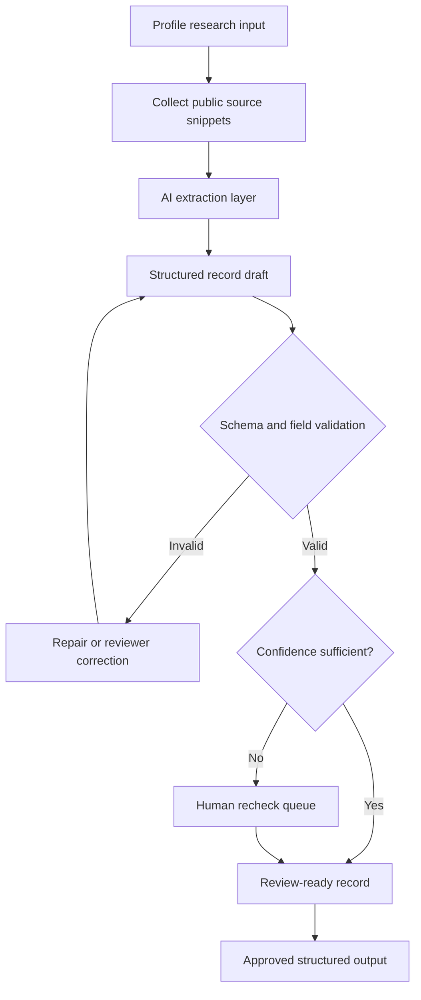

# Profile Research Agent

Sanitized case study based on profile research workflows that turn public profile inputs into structured review records.

## What This Is Based On

- Batch profile analysis workflows
- AI-assisted public signal extraction
- Structured profile scoring prompts
- Fact-sheet/profile research agent patterns
- Confidence fields, recheck notes, and human review

## What It Demonstrates

- Public profile/source input
- Signal extraction across bio, activity, category, and risk/fit fields
- Structured output instead of loose AI prose
- Confidence and missing-field handling
- Human review before downstream use
- Separation between raw model output and approved structured records

## How It Works

1. A profile or research target enters the queue.
2. Public signals are gathered from provided source snippets or profile summaries.
3. An AI extraction layer produces structured fields.
4. Validation checks required fields and expected output shape.
5. Low-confidence or missing fields are flagged for human review.
6. Approved records can be handed off to lead review, research notes, or reporting.

## Architecture



## Example Input

```json
{
  "request_id": "profile_research_demo_001",
  "target_ref": "profile_demo_001",
  "goal": "Extract operationally useful profile signals for review.",
  "sources": [
    {
      "source_type": "public_profile_summary",
      "content": "Work in startup operations, automation, and AI-assisted execution."
    }
  ]
}
```

## Example Output

```json
{
  "validation_status": "valid",
  "structured_record": {
    "category": "workflow_systems",
    "fit_tier": "high",
    "confidence": 0.82,
    "signals": ["startup operations", "workflow automation", "human review queues"],
    "needs_human_recheck": true
  }
}
```

## What Was Sanitized

This example removes vertical-specific labels, model/provider names, real handles, raw model responses, private prompts, actual profile lists, private source material, and generated real-person outputs.

## What To Notice

This case study is about making AI output operationally usable: structured records, confidence flags, validation, and review notes rather than unbounded text.
