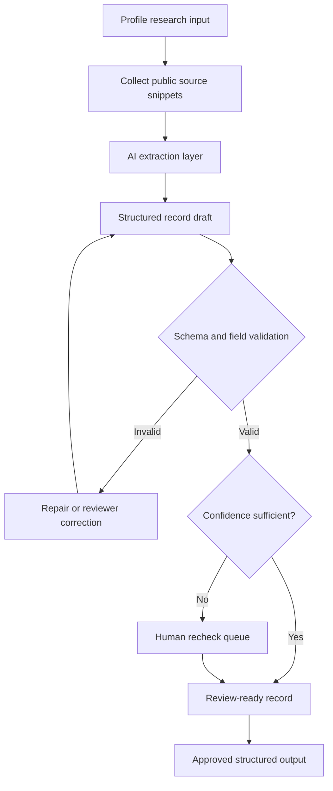

# Profile Research Agent

A structured-output research workflow for turning profile inputs into review-ready records.

## Context

- Based on batch profile analysis and fact-sheet style research
- Converts public source snippets into structured fields
- Uses confidence, missing-field handling, and human review before downstream use

## Architecture



## Example Input

IDs are public example keys. They represent stable workflow references such as contact refs, form submissions, review records, or handoff keys.

```json
{
  "request_id": "profile_research_request_001",
  "target_ref": "profile_001",
  "goal": "Extract operationally useful profile signals for review.",
  "sources": [
    {
      "source_type": "public_profile_summary",
      "content": "Work in startup operations, automation, and AI-assisted execution."
    }
  ]
}
```

## Example Output

```json
{
  "validation_status": "valid",
  "structured_record": {
    "category": "workflow_systems",
    "fit_tier": "high",
    "confidence": 0.82,
    "signals": ["startup operations", "workflow automation", "human review queues"],
    "needs_human_recheck": true
  }
}
```

## What To Notice

- The output is structured JSON, not loose AI prose.
- Confidence and missing-field handling decide what needs human recheck.
- Approved records can feed later review, reporting, or handoff workflows.
