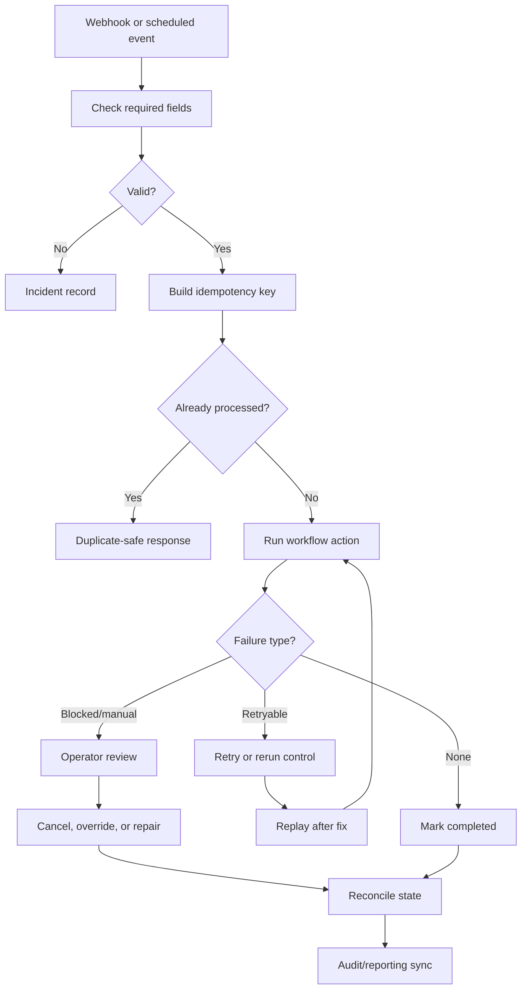

# Workflow Reliability & Error Handling

Sanitized cross-system case study based on retry paths, rerun controls, cached failures, admin overrides, idempotent handoffs, cancellation/reconciliation logic, and repair scripts.

## What This Is Based On

- Workflow retry and rerun controls
- Cached failure handling
- Manual cancellation paths
- Idempotent approval/outbound handoffs
- Admin override and sync repair patterns
- Reconciliation/reporting workflows
- Temporary repair workflows for stuck states

## What It Demonstrates

- Webhook/event dedupe
- Idempotency keys
- Required-field checks before side effects
- Retryable vs permanent failures
- Incident records
- Operator review and replay
- Cancellation and reconciliation controls

## Operational Complexity

- Required-field checks before downstream side effects
- Idempotency key and duplicate branch to prevent repeated handoffs
- Retryable vs permanent failure classification
- Incident record and alert stub for operator visibility
- Replay/recovery path after the root cause is fixed

## How It Works

1. A synthetic event enters the workflow.
2. Required fields are checked before downstream action.
3. An idempotency key prevents duplicate side effects.
4. Retryable errors are routed to operator-visible incident records.
5. Permanent or blocked states require manual decision or cancellation.
6. Reconciliation updates reporting and final state after downstream events.
7. Repair paths allow controlled replay after the root cause is fixed.

## Architecture



## Example Payload

IDs are synthetic public examples. They represent stable workflow keys such as contact references, row IDs, form submissions, review records, or handoff keys.

```json
{
  "event_id": "event_001",
  "event_type": "record.approved",
  "source": "synthetic_demo",
  "payload": {
    "record_id": "record_001",
    "operation": "sync_to_downstream_system",
    "simulate_failure": false
  }
}
```

## Example Incident Record

```json
{
  "incident_id": "incident_001",
  "category": "retryable_sync_failure",
  "severity": "warning",
  "retry": {
    "attempt": 1,
    "max_attempts": 3,
    "replay_ready": true
  },
  "operator_action": "Review incident, confirm availability, replay or repair state."
}
```

In this case study, checking required fields means confirming the workflow has enough data to dedupe, route, sync, or replay safely before it takes downstream action.

## What Was Sanitized

This example removes exact internal workflow names, live endpoints, provider names, credentials, private schema names, production payloads, and real execution logs.

## What To Notice

Reliability is treated as part of the workflow design, not as an afterthought. The system makes failure states visible and recoverable.

## Synthetic n8n Demo

- [n8n-demo/workflow.json](./n8n-demo/workflow.json): importable synthetic workflow
- [n8n-demo/sample-payload.json](./n8n-demo/sample-payload.json): mock event payload
- [n8n-demo/sample-output.json](./n8n-demo/sample-output.json): mock incident/replay result
- Future screenshot path: `assets/n8n-workflow-snapshot.png`
