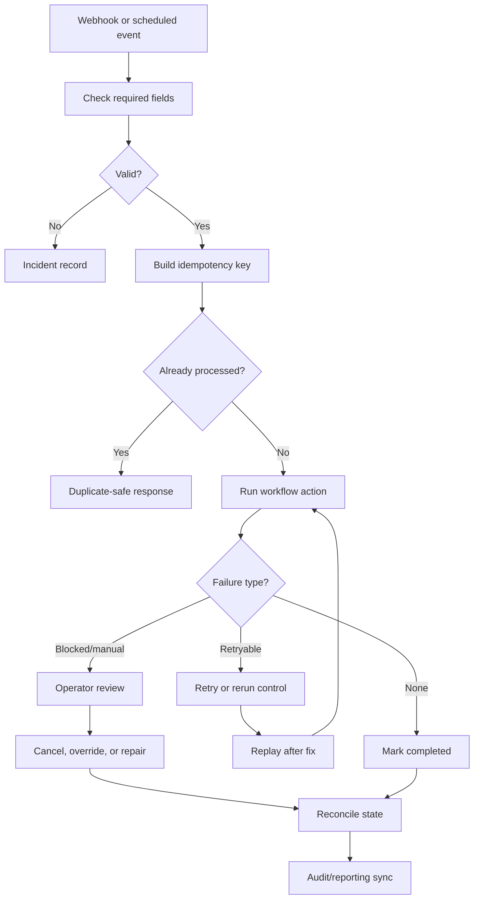

# Workflow Reliability & Error Handling

A reliability workflow for dedupe, idempotency, incident records, operator review, and replay.

## Context

- Based on retry paths, rerun controls, cached failures, and repair scripts
- Covers required-field checks, duplicate-safe handoffs, incidents, replay, and reconciliation
- Useful across onboarding, lead handoff, outbound lifecycle, and reporting workflows

## Architecture



## Example Payload

IDs are public example keys. They represent stable workflow references such as contact refs, form submissions, review records, or handoff keys.

```json
{
  "event_id": "event_001",
  "event_type": "record.approved",
  "source": "example_workflow",
  "payload": {
    "record_id": "record_001",
    "operation": "sync_to_downstream_system",
    "simulate_failure": false
  }
}
```

## Example Incident Record

```json
{
  "incident_id": "incident_001",
  "category": "retryable_sync_failure",
  "severity": "warning",
  "retry": {
    "attempt": 1,
    "max_attempts": 3,
    "replay_ready": true
  },
  "operator_action": "Review incident, confirm availability, replay or repair state."
}
```

## What To Notice

- Required-field checks mean confirming there is enough data to route, sync, dedupe, or replay safely.
- Idempotency and duplicate checks protect downstream systems from repeated side effects.
- Incident and replay paths make workflow failures visible and recoverable.

## Synthetic n8n Demo

- [n8n-demo/workflow.json](./n8n-demo/workflow.json): importable workflow
- [n8n-demo/sample-payload.json](./n8n-demo/sample-payload.json): mock event payload
- [n8n-demo/sample-output.json](./n8n-demo/sample-output.json): mock incident/replay result
