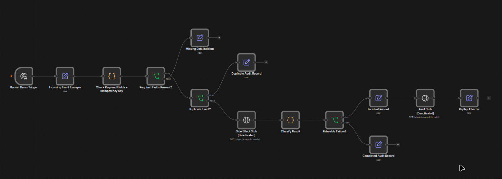

# n8n Demo

Importable n8n workflow for the reliability and error-handling case study.

## Preview

This canvas is a simplified portfolio version of the workflow pattern.

## Files

- `workflow.json`: workflow canvas
- `sample-payload.json`: reference event payload
- `sample-output.json`: expected output shape

## Use

1. Import `workflow.json` into a clean n8n workspace.
2. Run from the manual trigger.
3. Use `sample-payload.json` as the reference event.
4. Use the canvas snapshot as the public visual reference.
