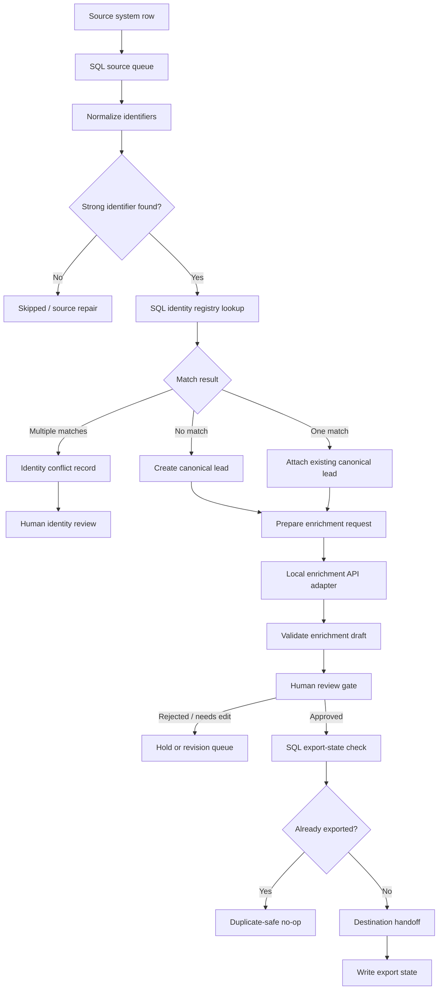

# Creator Lead Identity & Review Pipeline

A public-safe workflow pattern for turning noisy creator/source records into canonical, enriched, human-reviewed, export-safe lead records without silent duplicate merges.

This case study focuses on identity safety: separating raw source rows from canonical records, resolving strong identifiers through a SQL-backed registry, logging conflicts for operator review, and preventing duplicate downstream exports.

## Context

Many lead workflows start as spreadsheets because spreadsheets are fast for prototypes and human review. That is useful early, but it becomes fragile when the system needs durable identity, reruns, audit logs, conflict handling, and duplicate-safe handoff.

This pattern uses:

- n8n for orchestration
- SQL / PostgreSQL-style tables for workflow state
- a local enrichment API adapter for modular LLM enrichment
- human review before downstream export
- explicit export state so approved records are not accidentally sent twice

## Outcome
- Processed and supported outreach to 1,500+ leads per week
- Reduced manual processing time by approximately three minutes per lead
- Saved an estimated 75+ hours of operational work per week at a volume of 1,500 leads
- Maintained enrichment costs between USD 0.03 and USD 0.05 per lead, or up to approximately USD 75 per 1,500-lead batch
- Generated a 3–5% reply rate, equivalent to approximately 45–75 replies per 1,500 leads contacted
- Achieved a 1.4% visit rate, equivalent to approximately 21 visits per 1,500 leads

## Problem

A source system may contain duplicate, partial, or conflicting creator records. The same person can appear with multiple source rows, slightly different handles, changed display names, or repeated imports.

The system should not treat every source row as a new lead. It also should not merge records just because weak fields look similar.

The key problem is:

> How do we safely move from noisy source rows to canonical lead records without false merges, duplicate exports, or unreviewed AI decisions?

## System Goal

The workflow is designed to make each stage inspectable and safe to rerun:

1. source rows enter a SQL queue
2. handles and profile URLs are normalized
3. strong identifiers are checked against an identity registry
4. ambiguous matches are written to a conflict record
5. resolved canonical leads move to enrichment
6. LLM enrichment is generated through an API boundary
7. humans approve, reject, or return records for revision
8. export state prevents duplicate downstream handoff

## Architecture



## Why SQL Instead Of Spreadsheet-First State

Spreadsheets can be useful as review surfaces, but they are not ideal as the source of truth for identity resolution and export safety.

This pattern uses a SQL-backed state model because the workflow needs to enforce rules that are difficult to guarantee in a spreadsheet-first setup:

- one canonical UUID per resolved lead
- unique strong identifiers across the identity registry
- conflict records when identity cannot be safely resolved
- separate enrichment, human review, and export state
- duplicate-safe handoff to downstream systems
- operational queries for unresolved conflicts and stuck records

The important shift is that the database owns durable workflow state. The workflow tool orchestrates stages, but the SQL model enforces safety.

## Identity Resolution Rules

| Field | Identifier class | Can resolve identity? | Why |
|---|---:|---:|---|
| Profile URL | Strong | Yes | Stable external identity when normalized |
| Platform handle | Strong after normalization | Yes | Useful when paired with platform |
| Source row ID | Source reference | No | Identifies an import event, not the person |
| Display name | Weak | No | Too many false positives |
| Bio/category | Weak | No | Context only |
| Follower count | Weak | No | Changes over time |
| Notes/tags | Weak | No | Operator context only |

Strong identifiers can resolve identity. Weak fields can enrich context but cannot auto-merge records.

This prevents false duplicate suppression and avoids hiding conflicts behind automation.

## Database Model

The public schema uses synthetic table names:

- `lead_source_queue` stores raw source rows and processing status
- `canonical_leads` stores resolved lead records
- `identity_registry` maps strong identifiers to canonical UUIDs
- `identity_conflicts` records ambiguous matches for operator review
- `lead_enrichments` stores AI-generated draft enrichment and human review status
- `lead_exports` stores downstream handoff state

See [`schema/public-pattern-schema.sql`](./schema/public-pattern-schema.sql).

The most important constraints are:

```sql
create unique index identity_registry_unique_identifier
on identity_registry(identifier_type, identifier_value_norm);
```

```sql
create unique index lead_exports_unique_destination
on lead_exports(uuid, destination_system, destination_ref);
```

```sql
alter table identity_registry
add constraint identity_registry_identifier_strength_check
check (identifier_strength = 'strong');
```

These constraints make the workflow safer than relying only on n8n node memory or spreadsheet formulas.

## Local Enrichment API Adapter

The workflow treats LLM enrichment as a separate service boundary rather than embedding all model logic directly inside n8n.

In the private prototype, enrichment was called through a local API adapter so the workflow could use a stable request/response contract during development. This public demo represents that pattern with a synthetic local API example and mock response contract.

This keeps the system modular:

- n8n owns orchestration
- SQL owns durable state
- the local API adapter owns enrichment request shaping and response formatting
- human review owns final approval before export

The public example does not claim a production cloud deployment. A hosted version would add authentication, logging, rate limits, timeouts, model-provider abstraction, and deployment monitoring.

See [`scripts/local-enrichment-api.example.mjs`](./scripts/local-enrichment-api.example.mjs).

## Conflict Handling

When a source row maps to multiple possible UUIDs, the workflow writes an `identity_conflicts` record instead of silently merging.

A conflict record includes:

- the normalized identifier that caused the conflict
- candidate UUIDs
- source queue reference
- resolution status
- operator action required

The operator can then choose to merge, split, ignore, or repair source data outside the automated path.

## Enrichment And Human Review

Only resolved canonical leads move into enrichment.

The LLM output is treated as a draft recommendation. It can suggest fit tier, confidence, summary, and recommended action, but it does not directly trigger export.

Human review status is separate from export status:

```text
pending_review -> approved -> export_eligible -> exported
```

This prevents AI analysis from becoming an unreviewed downstream action.

## Export Safety

Before destination handoff, the workflow checks `lead_exports` for an existing row with the same:

```text
uuid + destination_system + destination_ref
```

If a matching export state exists, the workflow returns a duplicate-safe no-op result.

This means rerunning the workflow should not create duplicate downstream records.

## Example Input

```json
{
  "source_item_id": "source_item_001",
  "source_platform": "example_source",
  "profile_url": "https://social.example/example_creator",
  "handle": "@example_creator",
  "display_name": "Example Creator",
  "processing_status": "queued"
}
```

## Example Output

```json
{
  "source_queue_status": "processed",
  "identity_resolution": "single_uuid_match",
  "canonical_uuid": "lead_uuid_001",
  "registry_records_written": 2,
  "conflict_records_written": 0,
  "enrichment_status": "drafted",
  "human_review_status": "approved",
  "export_status": "exported",
  "duplicate_safe": true
}
```

## Failure Modes

| Failure mode | System behavior |
|---|---|
| No strong identifier | Skip or send to source repair |
| Multiple UUID matches | Write identity conflict record |
| Malformed enrichment response | Hold for review / retry adapter |
| Human rejects lead | Archive or hold without export |
| Approved lead already exported | Return duplicate-safe no-op |
| Destination handoff fails | Keep export state pending/failed for retry |

## What To Notice

- Raw source rows are not treated as identity truth.
- Weak fields can support enrichment but cannot auto-merge leads.
- The SQL registry enforces uniqueness for strong identifiers.
- Conflicts are logged instead of hidden.
- LLM enrichment is isolated behind a local API-style boundary.
- Human review is separate from export state.
- Duplicate-safe export is enforced with SQL state, not only workflow memory.

## Synthetic n8n Demo

The demo workflow uses sticky-note lanes to make the canvas readable as a systems diagram:

- Public Safety
- SQL Source Queue
- Identifier Normalization
- SQL Identity Registry
- Conflict Handling
- Local Enrichment API Adapter
- Human Review Gate
- SQL Export State
- Ops / Health Checks

Files:

- [`n8n-demo/workflow.json`](./n8n-demo/workflow.json): importable synthetic workflow
- [`n8n-demo/sample-input.json`](./n8n-demo/sample-input.json): mock source queue payload
- [`n8n-demo/sample-output.json`](./n8n-demo/sample-output.json): mock lifecycle result

After importing the workflow into n8n, save a clean canvas screenshot here:

```text
06-creator-lead-identity-review-pipeline/n8n-demo/n8n-workflow-snapshot.png
```

The screenshot should show the sticky-note lanes and avoid browser chrome, sidebars, private workspace names, execution panels, credentials, and real data.

## Sanitization Boundary

This public case study does not include:

- real creator leads
- private source-system names
- private LLM provider names
- private prompts
- real credentials
- production database URLs
- private endpoints
- production screenshots
- client or company data

The implementation is intentionally synthetic, but the architecture mirrors the real class of problem: SQL-backed workflow state, identity safety, AI enrichment, human review, and duplicate-safe handoff.

## N8N Video Walkthrough 

- https://www.loom.com/share/e119cb13fd9f4e7f9d587ed3d2616882
