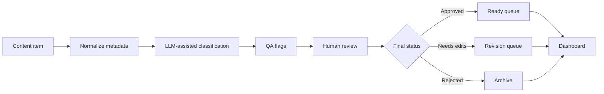

# System Recipe: Content Ops Review System

This synthetic recipe shows how to combine LLM-assisted review, QA controls, and dashboarding for a generic content operations queue.

All data in this file is synthetic and created for demonstration purposes.

## Goal

Help a team classify, review, and track content items without allowing automation to publish or approve anything without human oversight.

## Patterns Combined

- [LLM-Assisted Review & Classification](../../patterns/llm-assisted-review-and-classification/README.md)
- [Human-in-the-Loop Operations](../../patterns/human-in-the-loop-ops/README.md)
- [Google Sheets Dashboarding for Growth Ops](../../patterns/google-sheets-dashboarding/README.md)

## Example Synthetic Workflow

## Build Sequence

1. Define content item fields such as title, source, status, owner, and review due date.
2. Add a controlled classification list.
3. Ask the LLM for a suggested category, confidence level, and short rationale.
4. Add QA flags for missing metadata, low confidence, or policy-sensitive content.
5. Route every item through human review before final status.
6. Track reviewer overrides and common reasons for revision.
7. Build a dashboard for queue size, stale items, approval rate, revision rate, and owner workload.

## Decision Points

- Which content categories are allowed?
- Which QA flags block approval?
- Who owns final review?
- How often should reviewer overrides be sampled?
- What status values are simple enough for the team to maintain?

## Failure Modes To Plan For

- Reviewers approve too quickly without reading rationale.
- The model over-classifies ambiguous content.
- Too many statuses create operational confusion.
- Stale items sit without escalation.
- Dashboard counts do not match the review queue.

## What This Shows

This recipe demonstrates responsible use of LLMs in content operations: automation prepares and classifies, while humans remain accountable for final decisions.

