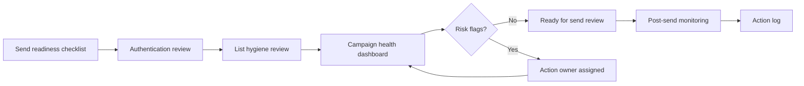

# System Recipe: Email Health Ops System

This synthetic recipe shows how deliverability monitoring, dashboarding, and human review can combine into an email operations workflow.

All data in this file is synthetic and created for demonstration purposes.

## Goal

Create a lightweight operating system for reviewing sender health, list hygiene, delivery signals, and action items before and after email sends.

## Patterns Combined

- [Email Deliverability Monitoring & Sender Health](../../patterns/email-deliverability-monitoring/README.md)
- [Google Sheets Dashboarding for Growth Ops](../../patterns/google-sheets-dashboarding/README.md)
- [Human-in-the-Loop Operations](../../patterns/human-in-the-loop-ops/README.md)
- [Intake Form to CRM Lifecycle Routing](../../patterns/crm-routing-and-lifecycle-automation/README.md)

## Example Synthetic Workflow

## Build Sequence

1. Define sender health checks such as authentication, suppression logic, and list hygiene.
2. Create a synthetic dashboard with directional health fields.
3. Add a readiness checklist before sends.
4. Add action owner and due date fields for unresolved issues.
5. Track post-send health signals directionally rather than exposing exact performance numbers.
6. Review recurring issues and update the checklist.

## Decision Points

- Which health signals block a send?
- Who owns unresolved deliverability issues?
- Which audience segments require extra review?
- How should action items be closed?
- What dashboard fields are useful without becoming noisy?

## Failure Modes To Plan For

- Authentication status changes without notice.
- Suppression logic is incomplete.
- Health checks become a checkbox exercise.
- Action items are not assigned to owners.
- Teams over-focus on engagement and ignore sender health.

## What This Shows

This recipe demonstrates how to turn deliverability from a one-off setup task into a repeatable operations process with clear review gates and dashboard visibility.

