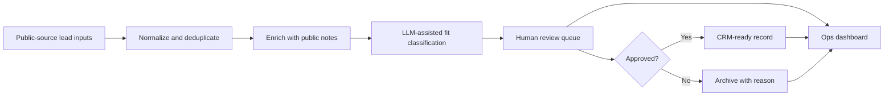

# System Recipe: Lead-to-CRM Review System

This synthetic recipe shows how several design patterns can be combined into a public-safe lead review workflow.

All data in this file is synthetic and created for demonstration purposes.

## Goal

Turn messy public-source lead inputs into clean, reviewable, CRM-ready records while keeping humans responsible for final approval.

## Patterns Combined

- [Multi-Stage Lead Enrichment & Review Queues](../../patterns/multi-stage-lead-enrichment/README.md)
- [LLM-Assisted Review & Classification](../../patterns/llm-assisted-review-and-classification/README.md)
- [Intake Form to CRM Lifecycle Routing](../../patterns/crm-routing-and-lifecycle-automation/README.md)
- [Google Sheets Dashboarding for Growth Ops](../../patterns/google-sheets-dashboarding/README.md)
- [Human-in-the-Loop Operations](../../patterns/human-in-the-loop-ops/README.md)

## Example Synthetic Workflow

## Build Sequence

1. Define the minimum fields required for a lead record.
2. Create synthetic intake rows and a normalized schema.
3. Add deduplication keys such as normalized name and public URL.
4. Add an enrichment note field for public-source summaries.
5. Add LLM-assisted classification fields: suggested label, confidence, and rationale.
6. Add review fields: reviewer, final decision, review note, and reviewed timestamp.
7. Export only approved records into a CRM-ready table.
8. Build a dashboard that tracks queue size, approvals, archived records, duplicates, errors, and stale reviews.

## Decision Points

- What fields are required before a record can enter review?
- Which records can be auto-archived, if any?
- Which classifications always require human approval?
- What confidence threshold routes a record to manual review?
- What makes a record CRM-ready?

## Failure Modes To Plan For

- Duplicate records are not caught.
- Low-confidence classifications move downstream.
- Review queues grow without ownership.
- CRM-ready exports miss required fields.
- Dashboard metrics drift from the underlying data.

## What This Shows

This recipe demonstrates how to combine enrichment, classification, review, routing, and reporting into one coherent operations workflow without relying on employer-owned details.

